# Money API Example

This is a repository containing a sample application that shows how to monetize your APIs using Zuplo.

It uses the following technologies:

- [Zuplo](https://zuplo.com) - API Gateway
- [Stripe](https://stripe.com) - Payment Processor
- [Auth0](https://auth0.com) - Authentication Provider
- [Vercel](https://vercel.com) - Web App Hosting

## How it works

This example shows how to monetize an API using Zuplo. It uses a simple ToDo API as an example.

Zuplo is used by companies that want to ship production-ready APIs to their customers. It offers beautiful Developer Docs, API Key authentication, rate-limiting and more.

This sample application consists of 3 parts:

- A Zuplo API Gateway that secures your API and allows you to monetize it
- A simple web-app using [NextJS](https://nextjs.org) that allows users to sign up and subscribe to your API
- A Stripe subscription product that allows your users to pay for the exact number of requests they make to your API


Your customers will be able to sign up to use your API using the web-app and make requests to your API using an API Key that they can generate in the Zuplo Developer Portal.

## Getting Started

[Fork](https://github.com/zuplo/money-api-example/fork) the repository as you will need to connect Zuplo to your own repository.

### Step 1 - Deploy the web-app to Vercel

The web-app is an example used to create a portal where users can sign up and subscribe to your API.

> The deployment will not work until all the steps in this guide are completed but you will get the deployment URL which is needed in the next steps

[](https://vercel.com/new/clone?repository-url=https%3A%2F%2Fgithub.com%2Fzuplo%2Fmoney-api-example%2Ftree%2Fmain%2Fdashboard&project-name=money-api&demo-title=Money%20API&demo-description=Monetize%20your%20APIs%20in%2010%20minutes.&demo-url=https%3A%2F%2Fmoney-api.zuplo.com)

### Step 2 - Setup web-app login with Auth0

Auth0 is used to enable authentication _for the web-app only_ using social providers like Google, or email/password. This is to secure users that are logging into the website and **not** to the API. For the API, your users will be able to issue an API Key using the Developer Portal created with Zuplo.

Steps:

1. Create and account and log-in in Autho [https://auth0.com](https://auth0.com)

2. Create an Application

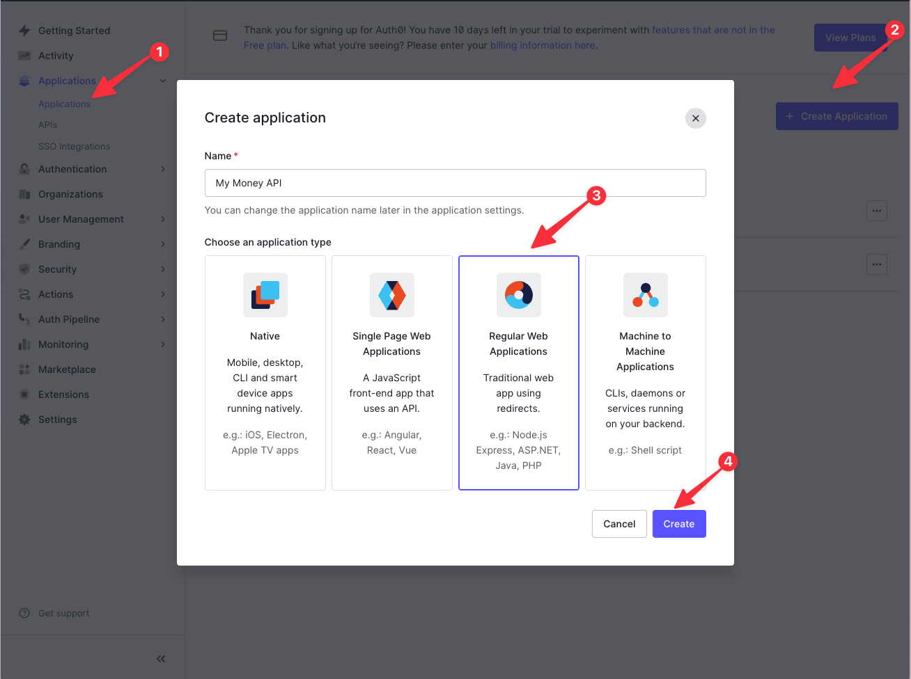

3. In the _Settings_ tab, update the _Allowed Callback URLs_ field. You'll add the domains that your app authentication will work with, using comma separated values:

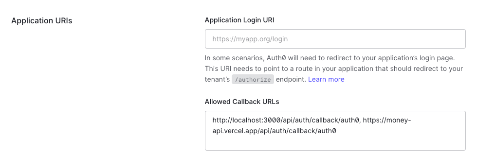

```
http://localhost:3000/api/auth/callback/auth0, https://$MY_APP_DOMAIN/api/auth/callback/auth0
```

4. Copy the environment values you'll use in your APP

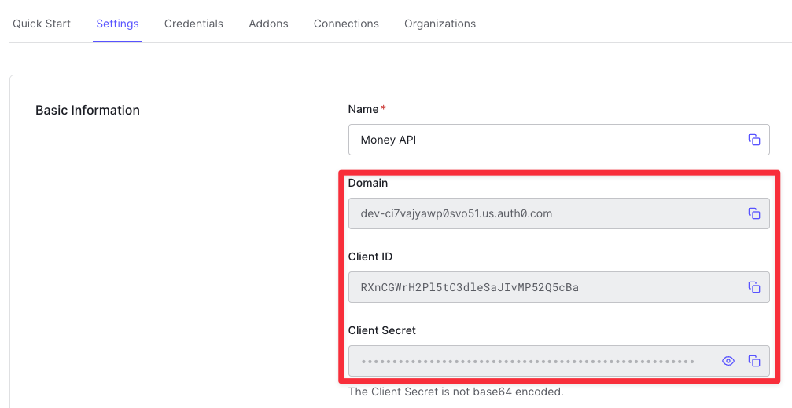

Your env file will look like this:

```
# .env file
AUTH0_ISSUER=https://dev-ci7vajyawp0svo51.us.auth0.com
AUTH0_CLIENT_ID=RXnCGWrH2Pl5REDACTED
AUTH0_CLIENT_SECRET=REDACTED
```

### Step 3 - Create a Stripe Subscription Product

Stripe is used to manage the subscription of your users to your API. In this section, you will create a Stripe subscription product to allow your users to "pay as they go" and bill them for the exact number of requests that they made in a period of time.

Steps:

1. Log in to Stripe https://stripe.com (if you're creating a new account, you can skip the section of _Activate payments on your account_)

2. Create a subscription Product

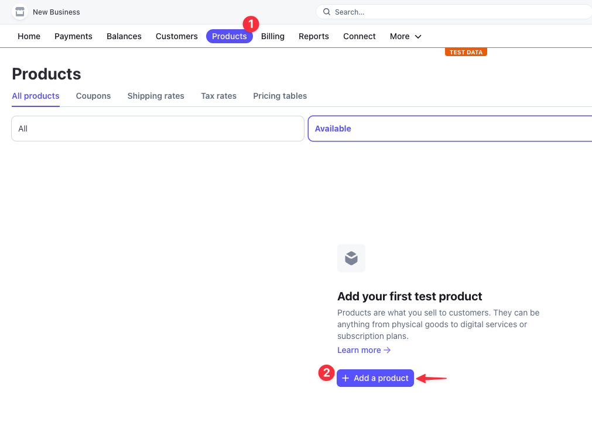

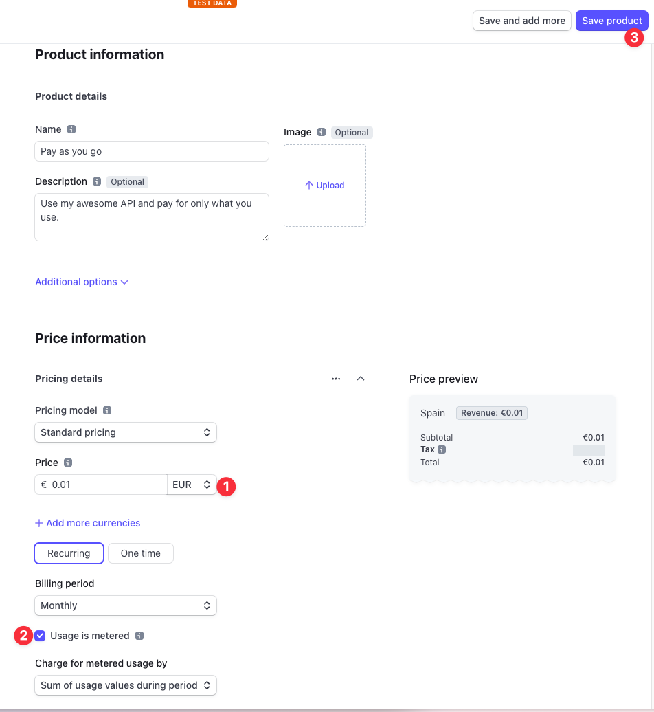

3. Create a Pricing Table to embed on the web-app

Go back to _Product_ page.

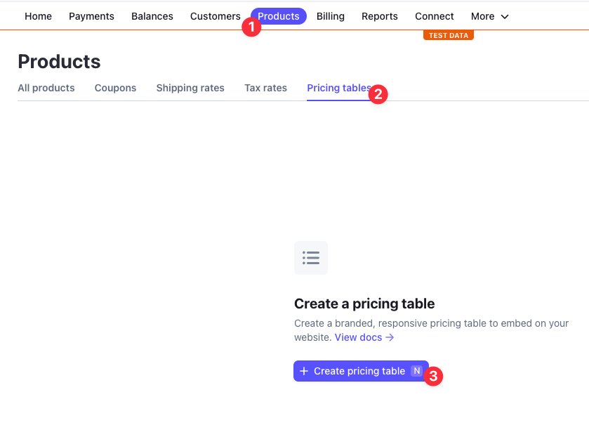

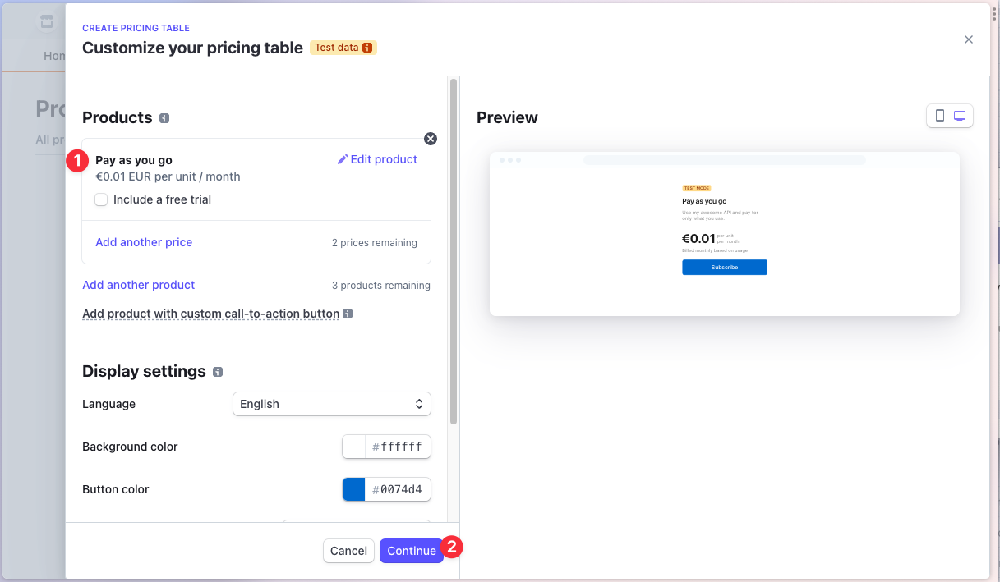

Make sure to set the checkout redirect to the deployed web-app domain:

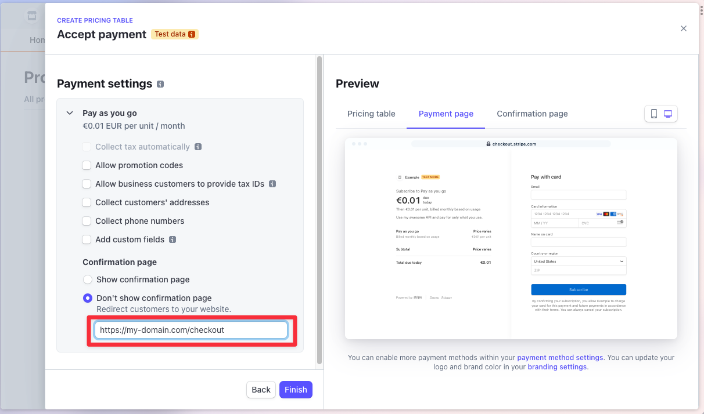

4. Add the Pricing table to your website

Copy the Pricing Table and paste in [`/dashboard/components/stripe-pricing-table.tsx`](./dashboard/components/stripe-pricing-table.tsx)

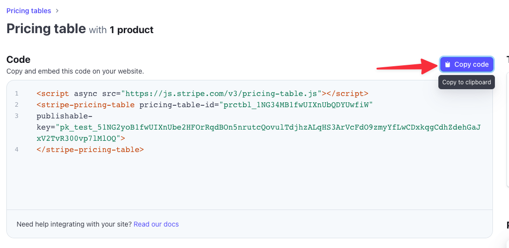

```diff
<div
  dangerouslySetInnerHTML={{
    __html: `
-        YOUR SUBSCRIPTION TABLE HERE
+        <script async src="https://js.stripe.com/v3/pricing-table.js"></script>
+        <stripe-pricing-table pricing-table-id="prctbl_1234ABC" publishable-key="pk_test_1234ABC">
+        </stripe-pricing-table>
      `,
  }}
/>
```

5. Save your Stripe Secret Key

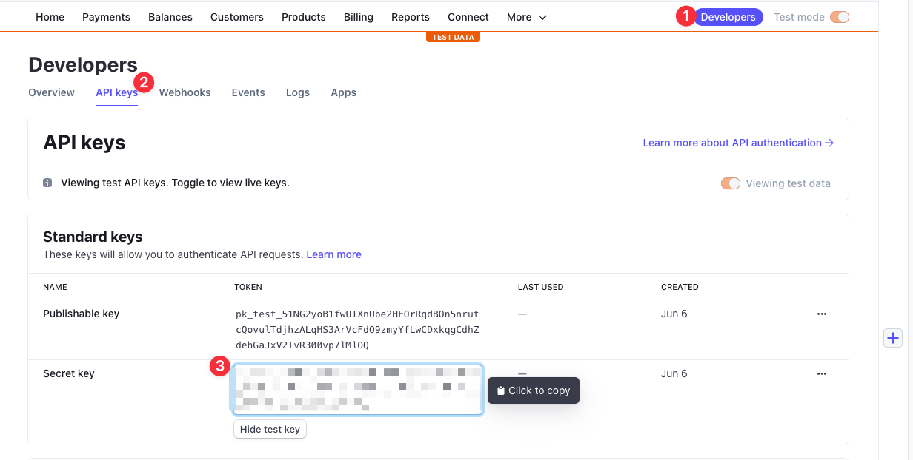

```
# .env
STRIPE_SECRET_KEY=sk...
```

### Step 4 - Add an API Gateway to your API with Zuplo

The project you just forked contains configuration for the Zuplo API Gateway.

You can find the OpenAPI definition for a ToDo API under `config/routes.oas.json` which will be used by Zuplo to create the documentation of your API and also configure the routes to set-up API Key authentication and custom code to allow for monetizing your API directly from your API Gateway.

Under `/modules/monetization` you'll find a custom Zuplo Policy that we wrote which receives a requests and triggers user billing with Stripe.

The backend for this app can live anywhere and be written in any language, but in this example for simplicity we've used https://jsonplaceholder.typicode.com

Steps:

1. Create an account with Zuplo: http://zuplo.com

2. Create a Zuplo project from the template that you just forked

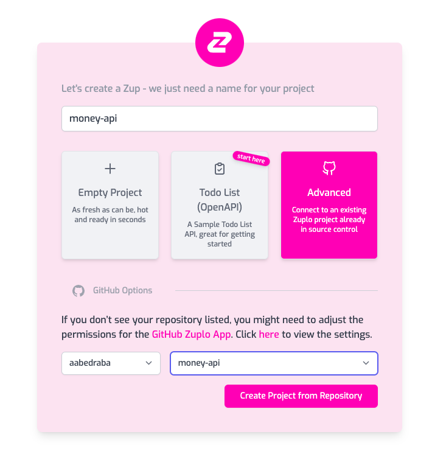

3. Copy the Zuplo Gateway URL

This is the URL that you'll use to make requests to your API.

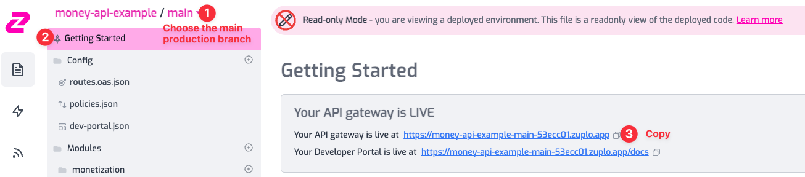

```
# .env
ZUPLO_GATEWAY_URL=https://money-api-example-main-53ecc01.zuplo.app
```

4. Copy the Zuplo Account ID and Project ID

<div style="display: flex">
  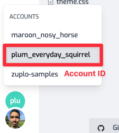
  
</div>

```
# .env
ZUPLO_ACCOUNT_ID=plum_everyday_squirrel
ZUPLO_PROJECT_ID=teal-hornet
```

5. Create your credentials with Zuplo's Developer API

You can find this in your Accounts Settings page in Zuplo.

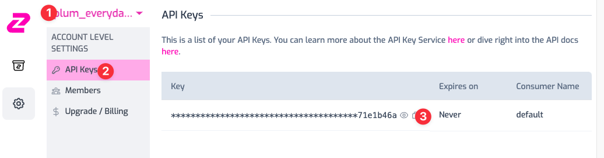

```
# .env
ZUPLO_API_KEY=zpka_...
```

6. Get the Zuplo API Bucket name

Run in your terminal to fetch the name of the API Bucket that you'll use to create API Keys for your users.

```sh
export ZUPLO_ACCOUNT_ID=your-account-id
export ZUPLO_API_KEY=zpka_ABC123

curl -s -X GET "https://dev.zuplo.com/v1/accounts/$ZUPLO_ACCOUNT_ID/key-buckets" -H "Authorization: Bearer $ZUPLO_API_KEY" | jq ".data[1].name"

"zprj-123ABC-production"
```

```
# .env
ZUPLO_KEY_BUCKET=zprj-123ABC-production
```

## Step 5 - Update the Environment Variables of your Web-App

Now that you have all the environment variables of your account, you can update the environment variables in Vercel to make your web-app work.
